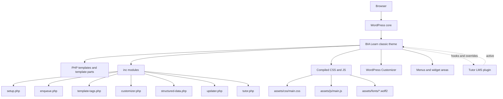
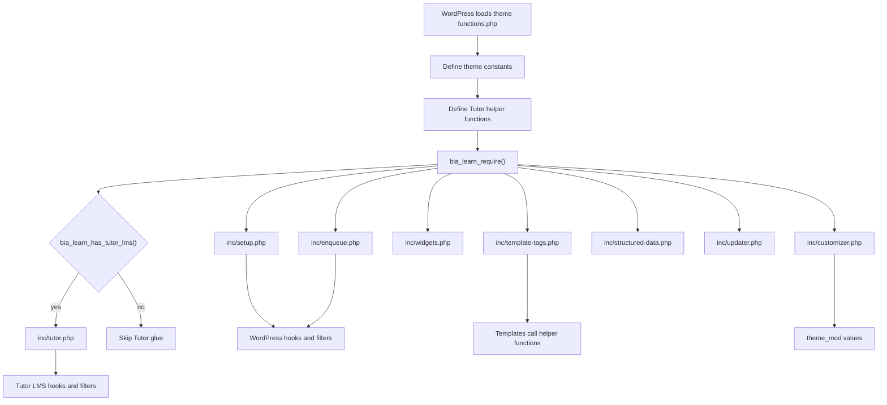
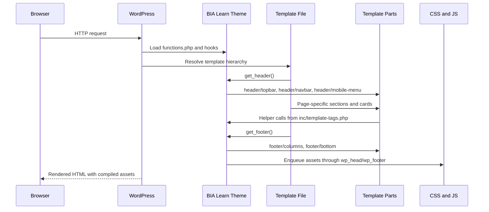
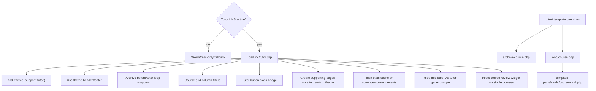
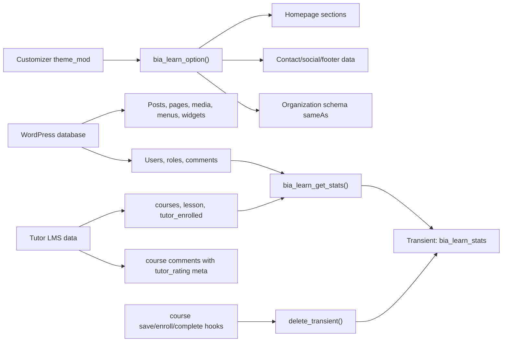
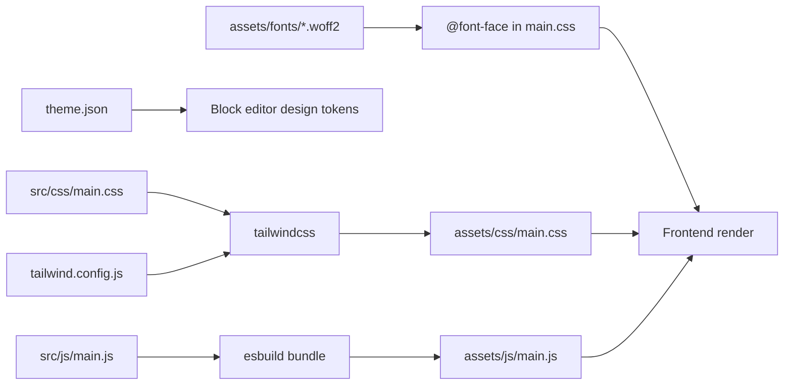
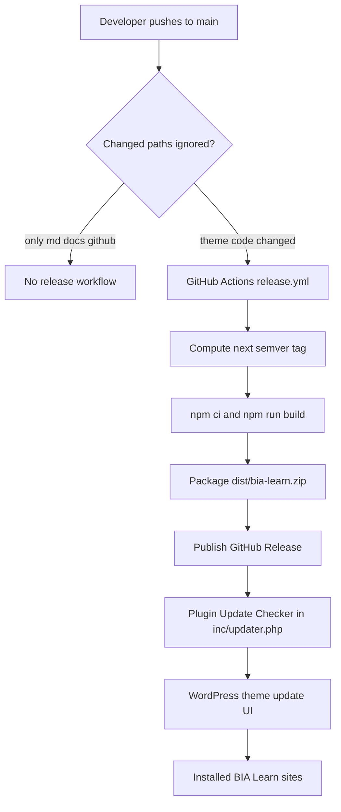
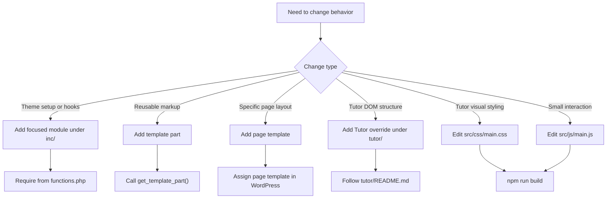

# BIA Learn Theme Architecture

เอกสารนี้อธิบายสถาปัตยกรรมของธีม `BIA Learn` ตามโค้ดใน repository ปัจจุบัน เพื่อใช้เป็น reference เวลาพัฒนา แก้บั๊ก หรือเพิ่ม integration ใหม่ ธีมนี้เป็น classic WordPress theme ที่ render ฝั่ง server เป็นหลัก ใช้ TailwindCSS สำหรับ design system, Alpine.js สำหรับ interaction เล็ก ๆ และเชื่อมกับ Tutor LMS แบบ optional

## ภาพรวมระบบ



### หลักการออกแบบ

- Theme เป็น classic theme ไม่ใช่ block theme เต็มรูปแบบ; `theme.json` ใช้กำหนด editor palette, typography และ layout ให้สอดคล้องกับ front end
- PHP templates เป็นแหล่ง render หลัก ส่วน reusable UI แยกอยู่ใน `template-parts/`
- `functions.php` เป็น bootstrap บาง ๆ ที่ define constants, helper สำหรับ Tutor LMS และ require โมดูลใน `inc/`
- Tutor LMS เป็น dependency แบบ optional: ถ้า plugin ไม่ active ธีมยัง render หน้า WordPress ปกติได้ และบางส่วน fallback จาก `courses` post type ไปเป็น `post`
- CSS/JS ที่ใช้งานจริงอยู่ใน `assets/` แต่ source ที่ควรแก้คือ `src/css/main.css` และ `src/js/main.js`

## โครงสร้างไฟล์หลัก

| Path | หน้าที่ |
| --- | --- |
| `functions.php` | Bootstrap ธีม, define `BIA_LEARN_VERSION`, `BIA_LEARN_DIR`, `BIA_LEARN_URI`, โหลดไฟล์ใน `inc/`, และโหลด `inc/tutor.php` เฉพาะเมื่อ Tutor LMS active |
| `inc/setup.php` | Theme supports, menus, image sizes, body classes, default menu, URL helper ของหน้า courses/news/supporting pages |
| `inc/enqueue.php` | Enqueue compiled assets, preload self-hosted fonts, favicon fallback, editor style |
| `inc/template-tags.php` | Presentation helpers เช่น breadcrumb, pagination, icons, page hero, stats, instructors, course progress, FAQ data |
| `inc/customizer.php` | Customizer panel สำหรับ hero, homepage sections, contact, social, footer และ CTA |
| `inc/structured-data.php` | JSON-LD สำหรับ Organization, BreadcrumbList, Article, FAQPage โดยยอมหลีกให้ SEO plugin หลัก |
| `inc/widgets.php` | Blog sidebar และ footer widget columns |
| `inc/updater.php` | GitHub Releases update checker ผ่าน vendored Plugin Update Checker |
| `inc/tutor.php` | Tutor LMS hooks, archive wrapper, button class bridge, supporting page creation, stats cache invalidation, course review widget |
| `template-parts/` | Header, footer, homepage sections, cards, breadcrumb, course catalog header |
| `page-templates/` | Page templates สำหรับ about, contact, FAQ, instructors, statistics, tutorial, auth |
| `tutor/` | Tutor LMS template overrides ที่ Tutor จะอ่านก่อน fallback ไป plugin |
| `src/` | Source CSS/JS สำหรับ build |
| `assets/` | Compiled CSS/JS, images, fonts, icons license |

## Bootstrap และโมดูล



`functions.php` intentionally keeps business logic out of the root file. When adding a new cross-cutting concern, prefer a focused file under `inc/` and load it from `functions.php`. When adding view-only markup, prefer `template-parts/` or a page template.

## Request และ Render Flow



### เส้นทางหน้าสำคัญ

- Homepage: `front-page.php` ประกอบจาก `template-parts/home/*` ตามลำดับ hero, categories, featured courses และ sections ที่เปิด/ปิดได้จาก Customizer
- Blog/news: `home.php`, `archive.php`, `single.php`, `search.php`, `index.php` ใช้ helpers สำหรับ hero, meta, pagination และ cards
- Static pages: `page.php` เป็น fallback; หน้าเฉพาะใช้ `page-templates/template-*.php`
- Header/footer chrome: `header.php` และ `footer.php` ใช้ `template-parts/header/*` และ `template-parts/footer/*`
- Tutor course archive: `tutor/archive-course.php` เพิ่ม catalog header และคง filter/pagination flow ของ Tutor
- Tutor course loop card: `tutor/loop/course.php` delegate ไปที่ `template-parts/cards/course-card.php`

## Tutor LMS Integration



Tutor LMS integration ใช้ 3 ชั้นพร้อมกัน:

1. Hooks/filters ใน `inc/tutor.php` สำหรับ behavior ที่ไม่ต้อง copy template เช่น grid columns, wrappers, button classes และ cache invalidation
2. Template overrides ใน `tutor/` สำหรับเปลี่ยนโครงสร้าง markup เฉพาะจุด
3. CSS bridge ใน `src/css/main.css` สำหรับ map `.tutor-*` classes เข้ากับสี ฟอนต์ ปุ่ม การ์ด forms badges dashboard และ quiz states ของธีม

ถ้าต้องเปลี่ยนแค่สี ระยะห่าง หรือ typography ให้เริ่มที่ `src/css/main.css` ก่อน ถ้าต้องเปลี่ยนลำดับ DOM หรือข้อมูลที่แสดง ค่อยเพิ่ม/แก้ Tutor override ใน `tutor/` และ diff กับ template จาก plugin version ที่ติดตั้งจริงเสมอ

## Data, Configuration และ Cache



แหล่งข้อมูลหลัก:

- WordPress core: posts, pages, media, menus, widgets, comments, users และ theme mods
- Tutor LMS: `courses`, `lesson`, enrolment records, instructor role/API, course ratings/reviews และ utility methods
- Transient cache: `bia_learn_stats` cache สถิติ 1 ชั่วโมง และถูกล้างเมื่อ course/enrolment/completion เปลี่ยน
- Filters สำหรับปรับแต่งโดยไม่แก้ template: `bia_learn_content_width`, `bia_learn_faq_items`, `bia_learn_partner_logos`, `bia_learn_featured_meta_key`, รวมถึง Tutor filters ที่ธีม hook ไว้

## Assets และ Design System



Development commands:

```bash
npm run dev
npm run build
```

Important rules:

- แก้ style ที่ `src/css/main.css` แล้ว build ไปที่ `assets/css/main.css`
- แก้ front-end JS ที่ `src/js/main.js` แล้ว build ไปที่ `assets/js/main.js`
- `assets/js/customizer.js` เป็น preview script สำหรับ Customizer และไม่ได้มาจาก `src/js/main.js`
- Tailwind scan ไฟล์ `**/*.php`, `src/js/**/*.js`, และ `tutor/**/*.php`; class ที่ถูก inject แบบ dynamic ต้องอยู่ใน `safelist`
- Fonts เป็น self-hosted ใน `assets/fonts/` และ preload จาก `inc/enqueue.php`; ไม่มี external font CDN

## Release และ Update Flow



`inc/updater.php` ใช้ Plugin Update Checker ที่ vendored ไว้ใน `inc/lib/plugin-update-checker/` และเลือก release asset ที่ชื่อ `bia-learn.zip` ก่อน source zip เพื่อให้ folder name และ compiled assets ถูกต้อง Release workflow จะไม่ทำงานเมื่อ push แตะเฉพาะ markdown, `docs/**`, หรือ `.github/**`

## Structured Data และ SEO Boundary

`inc/structured-data.php` สร้าง JSON-LD graph เบา ๆ สำหรับ:

- `Organization` ทุกหน้า
- `BreadcrumbList` ตาม view ปัจจุบัน
- `Article` บน single post
- `FAQPage` บน `page-templates/template-faq.php`

โมดูลนี้หยุดทำงานเมื่อพบ SEO plugin หลัก เช่น Yoast, Rank Math, SEOPress หรือ AIOSEO เพื่อหลีกเลี่ยง schema ซ้ำ Course schema ปล่อยให้ Tutor LMS เป็นเจ้าของ

## Extension Points



Guidelines:

- Keep root templates thin; move repeated markup to `template-parts/`
- Keep data/query helpers in `inc/template-tags.php` only when they are presentation-facing; broader concerns deserve their own `inc/*.php`
- Guard Tutor API usage with `bia_learn_has_tutor_lms()`, `bia_learn_tutor_utils()`, or `method_exists()`
- Escape output in templates with the appropriate WordPress escaping function
- Do not edit compiled assets directly unless intentionally patching generated output; source changes should be rebuilt
- When adding dynamic Tailwind classes from PHP, update `tailwind.config.js` safelist if static scanning cannot see them

## Operational Checklist

Before shipping a theme change:

1. Run `npm run build` if `src/css/main.css`, `src/js/main.js`, Tailwind config, or PHP classes changed
2. Check the affected WordPress template path manually in a local site when possible
3. For Tutor changes, test with Tutor LMS active and confirm the non-Tutor fallback still renders where applicable
4. For schema changes, confirm no duplicate graph is emitted when a supported SEO plugin is active
5. For release-related changes, confirm `.github/workflows/release.yml` packaging exclusions still include all runtime files and exclude dev-only files
